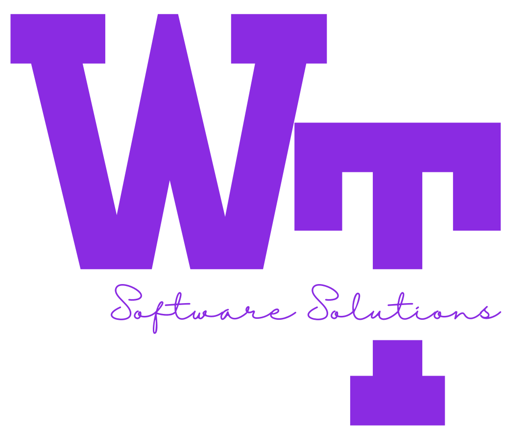

  

  <h1>Hi there, I'm Wahaj Tahir 👋</h1>

  

  

    
    
    
    
  

---

## 🧑‍💻 About Me

A seasoned **Software Development Engineer in Test (SDET)** with strong **DevOps** expertise. I make sure your web, mobile, and desktop applications are high-quality, bug-free, and seamlessly integrated into your build and deployment pipelines.

- 🔭 Building robust test automation frameworks and reliable CI/CD pipelines
- 🧪 Comfortable across UI, API, mobile, and performance testing
- ⚙️ Turning manual, flaky processes into fast, repeatable automation
- 🌐 Portfolio &rarr; **[wahajt.github.io](https://wahajt.github.io)**
- 💬 Ask me about test architecture, containerization, and infra as code

---

## 🛠️ Tech Stack

**Languages**

**Test Automation**

**DevOps & Cloud**

**Data & Docs**

---

## 📊 GitHub Stats

  
  

  

  

---

## 🤝 Connect With Me

  &nbsp;&nbsp;
  &nbsp;&nbsp;
  

  ⭐️ From <a href="https://github.com/WahajT">WahajT</a> — let's ship quality software together.

