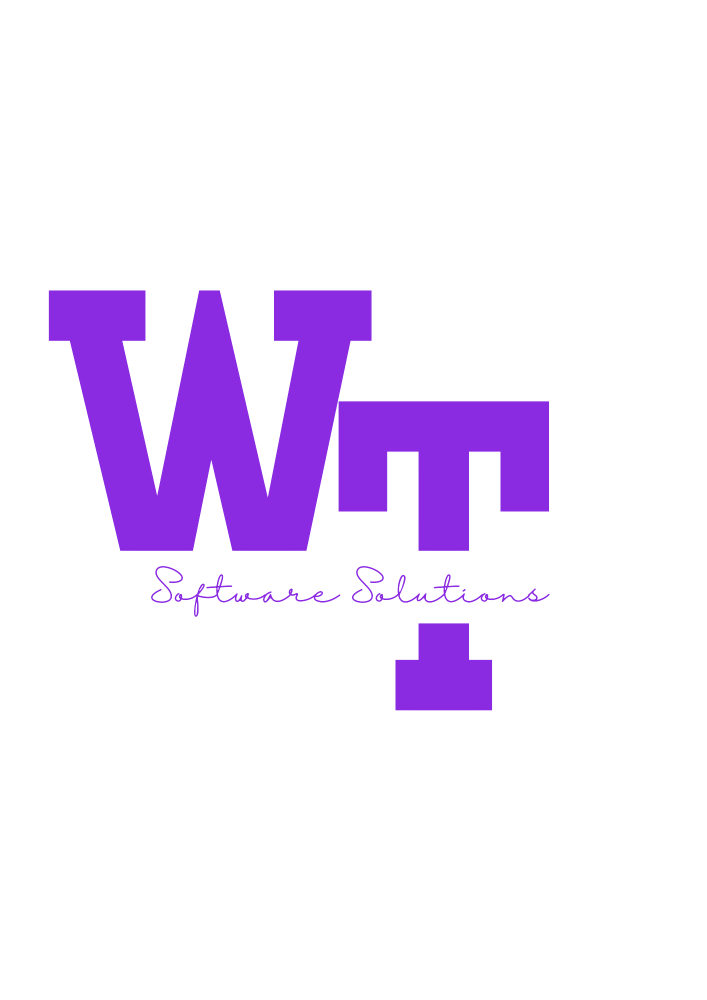

  
  <h1> Wahaj Tahir </h1>

  <h6> S.D.E.T and DevOps </h6>

As seasoned Software Development Engineer in Test (SDET) with strong DevOps expertise. I ensure that your web, mobile, and desktop applications are high-quality, bug-free, and seamlessly integrated into your development and deployment processes.

<h3 align="left">Connect with me:</h3>

<h3 align="left">Languages and Tools:</h3>

 
  <section id="tech-stack" class="tech-stack">
        <h1> My Tech Stack</h1>
 

     <!-- JAVASCRIPT -->
     
     <!-- PYTHON -->
     
     <!-- BASH -->
     
 
  

 <!-- New Line -->
 

     <!-- APPIUM -->
     
      <!-- SELENIUM -->
     
    <!-- RobotFrameWork -->
 
   

 <!-- New Line -->
 

     <!-- GITLAB -->
     

  <!-- POSTMAN -->
 
        <!-- LATEX -->
 
  

  
  <!-- New Line -->
  

    <!-- DOCKER -->
    
    <!-- KUBERNETS -->
    
    <!-- ANSIBLE -->
    
    

   <!-- New Line -->
   

  <!-- AWS -->
  
   

     <!-- New Line -->
 

